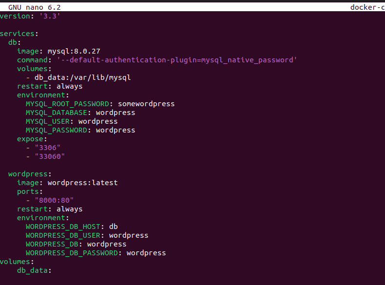

## 1. Docker project reference 

Links/resources: https://docs.docker.com/engine/install/ubuntu/ , https://www.hostinger.com/tutorials/run-docker-wordpress

## 2. Download process
 Make sure everything old is gone 
```shell 
for pkg in docker.io docker-doc docker-compose docker-compose-v2 podman-docker containerd runc; do sudo apt-get remove $pkg; done
```

Update apt-get

```shell
sudo apt-get update
```

Add Docker's official GPG key:
```shell
sudo apt-get install ca-certificates curl gnupg lsb-release
```
Create a directory for the Docker GPG key:
```shell
sudo install -m 0755 -d /etc/apt/keyrings
```

```shell
curl -fsSL https://download.docker.com/linux/ubuntu/gpg | sudo gpg --dearmor -o /etc/apt/keyrings/docker.gpg
```
Create a directory for the Docker GPG key:
```shell
sudo mkdir -p /etc/apt/keyrings
```
Change permssions
```shell
sudo chmod a+r /etc/apt/keyrings/docker.gpg
```
Add a Docker's GPG key:
```shell
curl -fsSL https://download.docker.com/linux/ubuntu/gpg
curl -fsSL https://download.docker.com/linux/ubuntu/gpg | sudo gpg --dearmor -o /etc/apt/keyrings/docker.gpg
```

### Creating the docke compose file
I got really hung up on this because of syntax but eventually thing was my result.



Docker compose
```shell
 nano docker compose up -d
```


Add the repository to Apt sources:

```shell
echo \
  "deb [arch="$(dpkg --print-architecture)" signed-by=/etc/apt/keyrings/docker.gpg] https://download.docker.com/linux/ubuntu \
  "$(. /etc/os-release && echo "$VERSION_CODENAME")" stable" | \
  sudo tee /etc/apt/sources.list.d/docker.list > /dev/null
sudo apt-get update
```


### To install the latest version, run:

```shell
sudo apt-get install docker-ce docker-ce-cli containerd.io docker-buildx-plugin docker-compose-plugin
```
### To confirm that the installation process was successful
```shell
sudo docker run hello-world
```


## Go to localhost:8000

You should see a page where you can set up your word press


