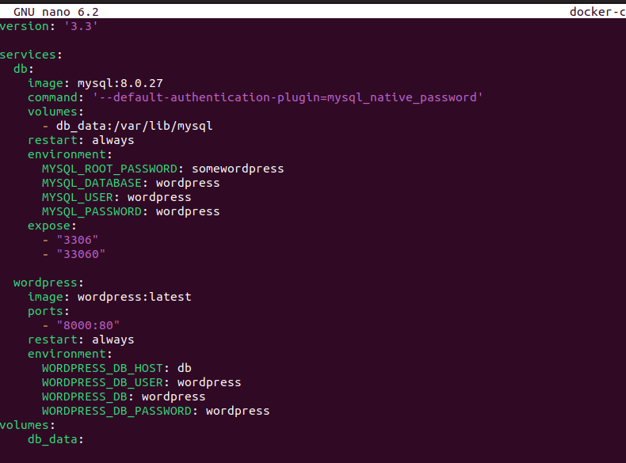

## 1. Project references  

Links/resources: https://youtu.be/GZRTnP4lyuo?si=8wtTXg_t7-BSSFMX , https://github.com/christianlempa/videos/tree/main/wireguard-docker


## 2. Droplet set up

The first part of this project is making sure you set up your droplet in digital ocean as Ubuntu 20.04 
 - I configured it with a password


#### Sign into your VPN using terminal to ssh in


## 3. Docker/ docker-compose

### Tools
```shell
sudo apt install apt-transport-https ca-certificates curl software-properties-common -y
```
### docker-compose
Installing docker compose 
```shell
sudo curl -L "https://github.com/docker/compose/releases/download/1.27.4/docker-compose-$(uname -s)-$(uname -m)" -o /usr/local/bin/docker-compose
```

Set permissions
```shell
sudo chmod +x /usr/local/bin/docker-compose
```


## Setting up Wireguard

Make sure you are in /opt or making wireguard in /opt

```shell
sudo mkdir /opt/wireguard-server
```


####cd into /opt/wireguard-server/ and create your yaml or yml file


- Make sure you change the PUID, GUID, TZ, SERVERURL, and also PEERs for how many people will be connecting to your VPN
- I said PEERS=2 because I will be testing this on my phone and computer


Add Docker's official GPG key:
```shell
sudo apt-get install ca-certificates curl gnupg lsb-release
```
Create a directory for the Docker GPG key:
```shell
sudo install -m 0755 -d /etc/apt/keyrings
```

```shell
curl -fsSL https://download.docker.com/linux/ubuntu/gpg | sudo gpg --dearmor -o /etc/apt/keyrings/docker.gpg
```
Create a directory for the Docker GPG key:
```shell
sudo mkdir -p /etc/apt/keyrings
```
Change permssions
```shell
sudo chmod a+r /etc/apt/keyrings/docker.gpg
```
Add a Docker's GPG key:
```shell
curl -fsSL https://download.docker.com/linux/ubuntu/gpg
curl -fsSL https://download.docker.com/linux/ubuntu/gpg | sudo gpg --dearmor -o /etc/apt/keyrings/docker.gpg
```

### Creating the docke compose file
I got really hung up on this because of syntax but eventually thing was my result.



Docker compose
```shell
 nano docker compose up -d
```


Add the repository to Apt sources:

```shell
echo \
  "deb [arch="$(dpkg --print-architecture)" signed-by=/etc/apt/keyrings/docker.gpg] https://download.docker.com/linux/ubuntu \
  "$(. /etc/os-release && echo "$VERSION_CODENAME")" stable" | \
  sudo tee /etc/apt/sources.list.d/docker.list > /dev/null
sudo apt-get update
```


### To install the latest version, run:

```shell
sudo apt-get install docker-ce docker-ce-cli containerd.io docker-buildx-plugin docker-compose-plugin
```
### To confirm that the installation process was successful
```shell
sudo docker run hello-world
```


## Go to localhost:8000

You should see a page where you can set up your word press


